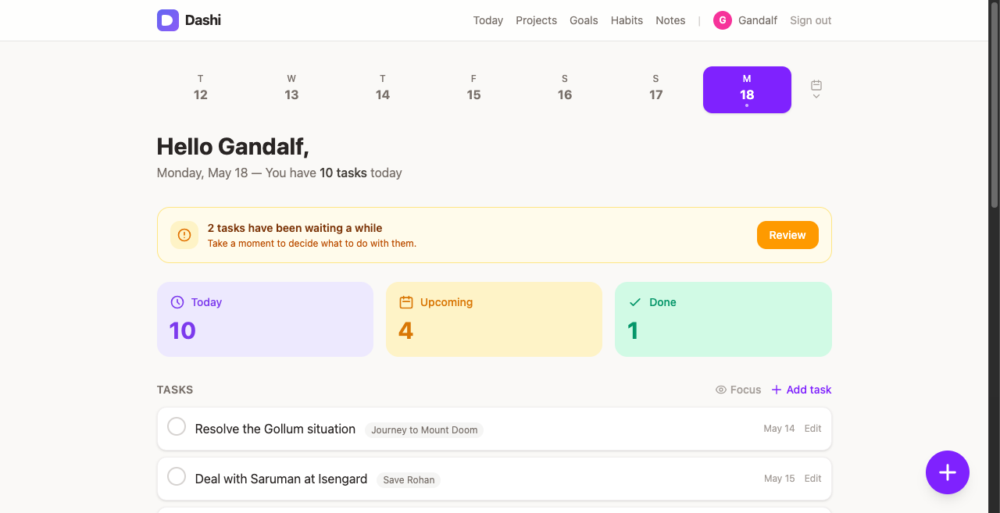
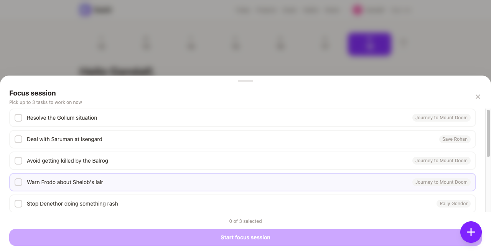
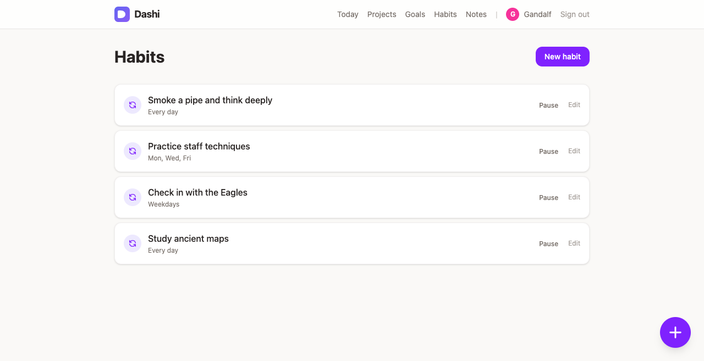
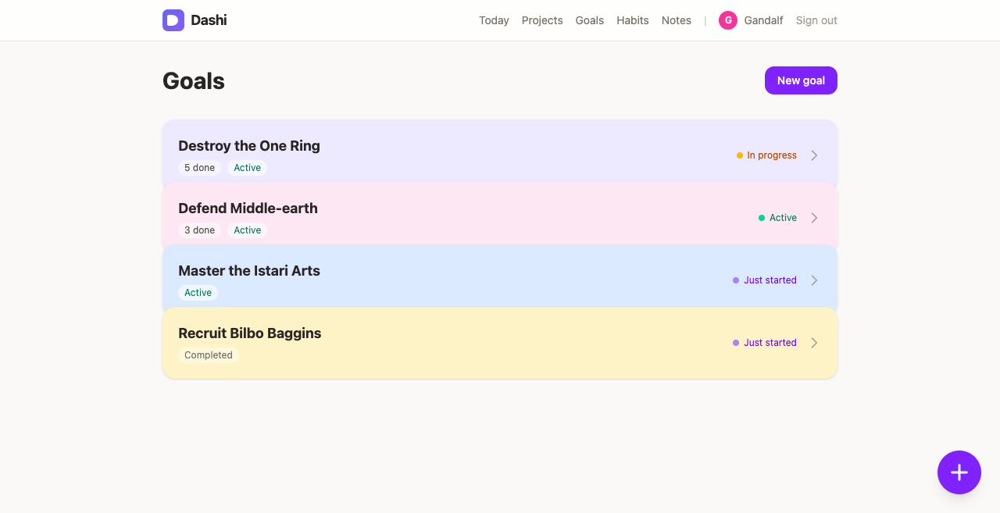

# Dashi

**A quiet place to keep your days in order.**

Dashi is a calm, focused productivity app for people who want a little more clarity in their day — not another system to maintain. Write down what matters, check things off, and move on.



---

## What is Dashi?

Each morning your daily page is waiting: what's due today, anything that carried over, and your habits running quietly in the background. No dashboards, no friction. Just a clear list and a good feeling when it's done.

If you want more structure, it's there. Todos can live under projects, projects under goals — so the small stuff connects to the bigger picture without you having to think too hard about it. Or skip all that and just write down what you need to do today. Both work fine.

Dashi is deliberately unhurried. It won't ask for your attention. It'll just be there when you need it.

### Three tiers (if you want them)

- **Goals** — long-term ambitions (e.g., "Get fit", "Learn Spanish")
- **Projects** — medium-term efforts that support a goal (e.g., "Run 3x/week")
- **Todos** — daily actionable items, optionally linked to a project (e.g., "Run 5k")

---

## Features

- **Daily page** — what's on for today, front and centre
- **Carryover** — past-due items surface automatically; reschedule, dismiss, or just do them
- **Focus sessions** — pick up to 3 tasks and drop into a distraction-free Pomodoro session
- **Reflection** — a quiet end-of-day check-in to close out your day
- **Habits** — recurring tasks that slot into your daily flow automatically
- **Goals & projects** — connect the small stuff to the bigger picture
- **Activity heatmap** — notice your own momentum over time
- **Upcoming view** — look ahead without losing sight of today
- **Works on phone and desktop** — clean on any screen size
- **Magic link sign-in** — no password to forget

---

## Screenshots

| Daily page | Focus session |
|---|---|
|  |  |

| Habits | Goals |
|---|---|
|  |  |

---

## Get Dashi

### Hosted on Kyper

The easiest way to run Dashi is via [Kyper](https://kyper.shop/apps/dashi) — a platform for small software that handles deployment, backups, and updates for you. Subscribe and you'll have a running instance in minutes.

**[→ Get Dashi on Kyper](https://kyper.shop/apps/dashi)**

### Self-host (open source)

Dashi is fully open source. Clone it, run it yourself, make it yours.

```bash
git clone https://github.com/lukepatrick/dashi
bin/setup
bin/dev
```

---

## Tech Stack

- Ruby on Rails 8 (Ruby 3.4)
- Hotwire (Turbo + Stimulus) for interactive UI
- Tailwind CSS for styling
- SQLite + Litestream for database with continuous backups
- RSpec for testing

---

## Development

```bash
bin/setup            # Install dependencies and set up database
bin/dev              # Start dev server
bundle exec rspec    # Run tests
bin/screenshots      # Regenerate screenshots (saved to docs/screenshots/)
```

### Logging in locally

The app uses magic link auth, so there's no password. To sign in as the seed user in development:

```bash
bin/rails console
```

```ruby
user = User.find_by(email: "admin@example.com")
token = user.generate_magic_token!
puts "http://localhost:3000/auth/verify?token=#{token}"
```

Paste the printed URL into your browser and you're in.
